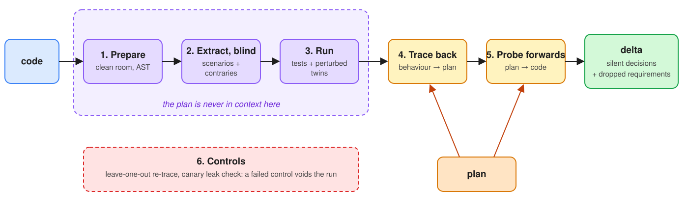

# silent-decisions

**Find what AI-written code decided that the plan didn't.**

> **Status: work in progress, research experiment, not a product.** The pipeline works end to end on
> two small test cases I built. The early result is that it does **not** beat a much simpler approach:
> a single prompted review found as many silent decisions at about a tenth of the cost, and hiding
> the plan from the reader (the core idea below) did not improve accuracy. See
> [Early conclusion](#early-conclusion). The likely next step is a lightweight skill, not this
> pipeline. The write-up is in the blog post (link coming).

## The problem

You write a plan. An AI agent implements it. The code is clean and the tests pass. Somewhere inside
it, the agent decided that withdrawals are capped at 5,000 a day, that amounts round half-up, and
that opening an account that already exists does nothing. None of that was in the plan.

These are **silent decisions**. Tests don't catch them, because the tests came from the same reading
of the same plan. Reviewers often miss them too, because a sensible rule read with the plan in mind
looks intended.

## The idea

Start from the code, not the plan. Describe what the code actually does, without ever showing the
plan to whoever describes it, run every description as a test, and only then ask, sentence by
sentence: *which of these behaviours does the plan actually ask for?* Whatever is left over is a
silent decision. Plan sentences the code doesn't satisfy are dropped requirements.

## How it works



1. **Prepare.** Copy the source into a clean room with comments, tests, docs and git history
   removed (agent code often carries the plan in its comments). An AST walk lists every decision
   point: literals, comparisons, rejection paths, rounding calls.
2. **Extract, blind.** A fresh agent that has never seen the plan writes what the code does as
   concrete Given/When/Then scenarios, each with a *contrary*: what a different reasonable
   implementation would do.
3. **Run everything.** Every scenario becomes a test. Each also runs with a perturbed twin that must
   fail.
4. **Trace back.** For each (plan sentence, scenario) pair, a small classifier answers one question:
   does this sentence require what the code does, the contrary, or neither? Asked twice with the
   options swapped; answers that move with position are discarded.
5. **Probe forwards.** Every behavioural plan sentence gets a probe test. A failing probe is a
   dropped requirement.
6. **Control the run.** Hide a few plan sentences and re-trace (dependent behaviours must come back
   unsourced). A canary string checks the extractor really was blind. A failed control voids the run.

The output is a short list of cards, each a choice between what the code does and an alternative.
See [`examples/ledger/sample-delta.md`](examples/ledger/sample-delta.md) (hand-written fixtures, for
the format). The full method is in [`docs/methodology.md`](docs/methodology.md).

## What happened

Two planted TypeScript cases (`ledger`: 10 silent decisions, `ledger-rounding`: 22) and seven runs,
comparing six arms:

| Arm | What it is | Sees the plan? |
|---|---|---|
| a | ask a model that "implemented" the code what it decided that the plan didn't say | yes |
| b | one sighted review pass: plan + code, list the unspecified decisions | yes |
| c | the pipeline, but the extractor can see the plan | yes |
| d | the pipeline, with an LLM tracer and adversary | no (extractor) |
| e | **the full pipeline** (blind extractor, execution, pairwise classifier trace, probes) | no (extractor) |
| f | static baseline: AST decision points matched to plan sentences, no model reading the code | – |

Runs 001–005 developed the pipeline (arms e, f). Runs 006–007 ran arms a–d. All the outputs were
then graded **at decision level by a blind grader**: a separate model session that saw the plan,
the code and the answer key, but not which method produced which list
([grading write-up](experiment/diary/grading/2026-10-07-blind/GRADING.md)). Recall = share of planted
silent decisions found; precision = share of flagged items that are real unplanned decisions.

**`ledger-rounding`** (the harder case, 22 decisions):

| Arm | Runs | Recall | Precision | Time · cost per run |
|---|---|---|---|---|
| a. self-report | 3 | 0.83 | 0.89 | ~1 min · ~$0.30 |
| b. sighted review | 3 | 0.82 | **0.93** | ~1 min · ~$0.30 |
| c. pipeline, sighted extractor | 1 | 0.86 | 0.82 | ~7 min · ~$2.20 |
| d. pipeline, LLM tracer | 1 | **0.91** | 0.77 | ~10 min · ~$3.10 |
| e. full pipeline (blind) | 3 | 0.83 | 0.85 | ~7 min · not logged |
| f. static baseline | 1 | 0* | – | 5 s |

Costs are API-equivalent figures reported by Claude Code (`claude-opus-5-5`). On `ledger`, every
model-based arm is near the ceiling (recall 0.90–1.0). Every arm found every dropped requirement on
both cases. All extracted scenarios were verified by execution.

\* Arm f lists code locations, not stated rules, so the blind grader rejected every item. A more
lenient reading credits it with about 0.5.

**Limits of this evidence:**

- **Self-made cases.** Both cases and their answer keys were written on my side, with an AI agent.
  They are small (one ~140-line file) with every rule written as an explicit `if` or constant: the
  setting where a single read-through should do best.
- **One model grader.** The grading was blind to the method, but it was done by a model, not a
  person. Writing styles differ between arms (free text vs Given/When/Then).
- **Tuned on the test set.** Each pipeline run's misses were fixed and re-measured on the same case.
- **High variance.** Three repetitions of the same arm differ by up to ~0.2 recall. c and d ran once.

Every run is recorded, including what went wrong, in [`experiment/diary/`](experiment/diary/README.md).
Each run's code is tagged `run-001` … `run-007`.

## Early conclusion

**Blindness did not improve accuracy.** The pipeline was built on one hypothesis: a model that can
see the plan describes the code as conforming to it, so the extractor must never see the plan. On
these cases the data does not support it:

- the sighted review (b, 0.82) found as many silent decisions as the blind pipeline (e, 0.83), with
  higher precision;
- the pipeline with a sighted extractor (c, 0.86) did as well as with a blind one (e, 0.83);
- the decisions the hardest to find (an interaction between transfers and the daily limit, for
  example) were missed by **every** arm, blind or not.

What the pipeline does add is **verification**: every scenario it reports has been executed, and every
dropped requirement it reports is confirmed by a failing test. It also caught one decision the
single-pass arms consistently missed. That is worth something, but on these cases not ten times the
cost.

**So the next step is probably a skill, not this pipeline:** a single, well-prompted review pass
(arm b's prompt is the starting point), with execution of its claims as an optional check, not a
multi-stage blind pipeline.

This is an early conclusion from two small cases I wrote myself. It could change on real code, where
rules are spread over many files and harder to see in one pass. The test that would settle it is
independent cases (real repositories, with answer keys written by someone else), and a "single pass
plus verification" arm against the full pipeline.

## Try it

Without any model (runs every script against recorded fixtures):

```bash
npm install
npm run example:install
./examples/ledger/demo.sh
npm test
```

As a Claude Code plugin, in a TypeScript/JavaScript project with `vitest`:

```bash
claude --plugin-dir /path/to/silent-decisions
```

> Check the code against `docs/plan.md` for silent decisions. The change started from `main`.

The classifier step uses Jev (`typesafe/jev-1.13` via OpenRouter, `OPENROUTER_API_KEY`) or any
fixed-label model behind `SD_CLASSIFIER_CMD`. To rerun the experiment: `experiment/run.sh <case> [arms]`
(see [`experiment/README.md`](experiment/README.md)).

## Layout

```
skills/silent-decisions/   portable core: SKILL.md, scripts/sd.mjs (CLI), prompts, classifier adapters
agents/, hooks/            Claude Code plugin pieces (generated agents, extractor confinement hook)
experiment/                six-arm experiment: prompts, runner, scorer, cases + answer keys, run diary
examples/                  the two test cases (plan + code) and recorded fixtures
docs/                      methodology write-up and explainer page
schemas/, test/            JSON Schemas for model output; tests for the deterministic scripts
CLAUDE.md                  notes for the local Claude Code session that ran the experiments
```

## Related work

The closest published neighbour is [AssumptionMiner](https://arxiv.org/abs/2607.22898) (Wu, 2026),
which extracts implicit assumptions from LLM-generated code with the prompt in view and without
executing anything. Older roots: characterization tests (Feathers), specification mining (Daikon),
requirements traceability, TiCoder. What this project tried that I haven't seen elsewhere: blind
extraction as a contamination control (which, so far, did not pay off; see
[Early conclusion](#early-conclusion)), execution-verified behaviour as the thing traced, and a
per-run control on the tracer.

## Licence

MIT
